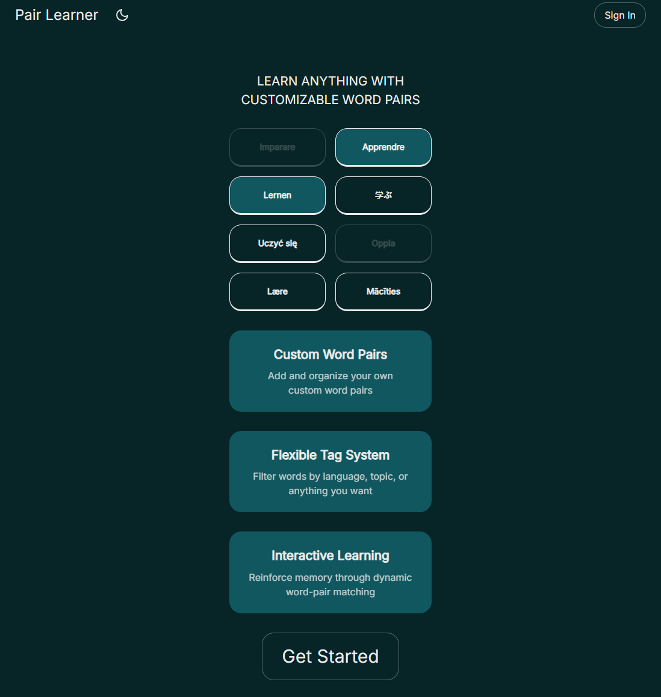

# Pair Learner

## Customizable Way to Learn New Words in Any Language

Pair Learner is an interactive web application designed to help users learn and memorize word pairs across multiple languages or subjects through engaging memory games.

  

## Features

- **Custom Word Pairs**
  Create, edit, and organize your own personalized word pairs.
- **Flexible Tag System**
  Categorize and filter words by language, topic, or any other custom tags.
- **Interactive Learning**
  Reinforce memory through dynamic word-pair matching games.
- **User Authentication**
  Secure login using Supabase Auth.
- **Cloud Sync**
  All of the data is stored on Supabase, enabling quick convenient access from any device.

## Technology Stack

- **Next.js**
- **Framer Motion**
- **Supabase**
